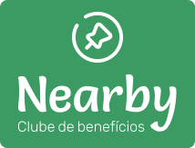
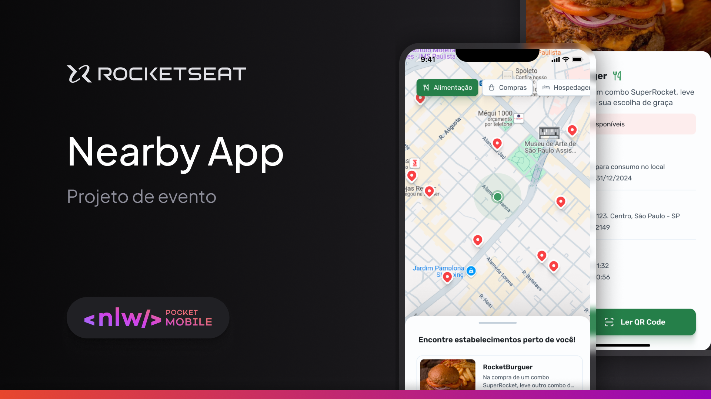

# Nearby App - Clube de Benefícios

## Tecnologias Utilizadas 💻

O aplicativo Nearby foi desenvolvido utilizando as seguintes tecnologias:

- [TypeScript](https://www.typescriptlang.org/)
- [React Native](https://reactnative.dev/)
- [Expo](https://expo.dev/)
- [React Native Bottom Sheet](https://github.com/gorhom/react-native-bottom-sheet)

## Sobre 📝

**Nearby** é um aplicativo mobile de clube de benefícios com cupons para utilizar em estabelecimentos próximos a você.

### Layout

Link do [Figma](https://www.figma.com/community/file/1448070647757721748)

## Projeto

>Esse é o projeto do evento NLW Pocket Mobile, um dos conteúdos disponíveis para alunos da Rocketseat. Desenvolvido na semana de 09 à 12 de Dezembro de 2024

➡️ Conheça a [Rocketseat](https://www.rocketseat.com.br/)

